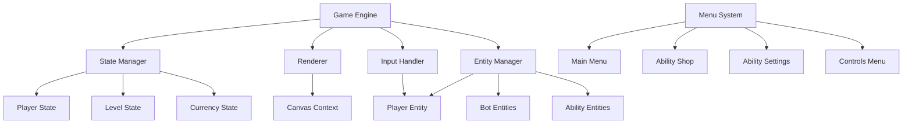

# Design Document: Island Fighting Game

## Overview

Island Fighting is a browser-based 2D fighting game built with HTML5 Canvas and vanilla JavaScript. The game features a player character battling waves of robot enemies on floating island platforms with progressive difficulty scaling. The architecture follows a component-based design with clear separation between game state management, rendering, input handling, and entity behaviors.

The game loop runs at 60 FPS, handling input processing, physics updates, collision detection, entity AI, and rendering. The system supports a currency-based progression system where players earn coins from defeating enemies and spend them on four unique abilities that can be customized to different control keys.

### Technology Stack

- HTML5 Canvas for rendering
- Vanilla JavaScript (ES6+) for game logic
- CSS for UI menus
- LocalStorage for persistence (coins, ability ownership, key bindings)

### Core Game Loop

```
Input Processing → State Updates → Collision Detection → AI Updates → Rendering
```

## Architecture

### High-Level Component Structure



### Component Responsibilities

**Game Engine**: Orchestrates the game loop, coordinates between systems, manages scene transitions between gameplay and menus.

**State Manager**: Maintains game state including level number, player stats, currency, ability ownership, and key bindings. Handles persistence to LocalStorage.

**Renderer**: Draws all game entities, UI elements, and effects to the Canvas. Implements pixelated art style through sprite rendering or pixel-perfect drawing.

**Input Handler**: Captures keyboard and mouse events, translates them to game actions, manages input buffering for responsive controls.

**Entity Manager**: Maintains collections of active entities (player, bots, projectiles), handles entity lifecycle (spawn, update, destroy), performs collision detection.

**Menu System**: Manages UI screens outside of gameplay, handles menu navigation, ability purchasing, and key binding configuration.

## Components and Interfaces

### Player Entity

```javascript
class Player {
  constructor(x, y) {
    this.x = x;
    this.y = y;
    this.hp = 100;
    this.maxHp = 100;
    this.velocityX = 0;
    this.velocityY = 0;
    this.width = 32;
    this.height = 48;
    this.isGrounded = false;
    this.punchCooldown = 0;
    this.shieldActive = false;
    this.shieldEndTime = 0;
    this.abilities = {
      z: null,
      x: null,
      c: null,
      v: null
    };
    this.abilityCooldowns = {
      z: 0,
      x: 0,
      c: 0,
      v: 0
    };
  }
  
  update(deltaTime, input, island) { /* movement, gravity, collision */ }
  takeDamage(amount) { /* reduce HP unless shielded */ }
  punch() { /* execute melee attack if cooldown ready */ }
  useAbility(key) { /* activate ability if owned and off cooldown */ }
  render(ctx) { /* draw player sprite */ }
}
```

### Bot Entity

```javascript
class Bot {
  constructor(x, y, level) {
    this.x = x;
    this.y = y;
    this.hp = 50 + (level * 10); // HP scales with level
    this.maxHp = this.hp;
    this.size = 24 + (level * 2); // Size scales with level
    this.velocityX = 0;
    this.velocityY = 0;
    this.speed = 2;
    this.contactDamage = 10;
    this.coinReward = 10 + (level * 5);
  }
  
  update(deltaTime, playerPos, island) { /* AI movement toward player */ }
  takeDamage(amount) { /* reduce HP, return true if defeated */ }
  render(ctx) { /* draw bot sprite */ }
}
```

### Ability System

```javascript
class Ability {
  constructor(type) {
    this.type = type;
    this.name = ABILITY_DATA[type].name;
    this.cost = ABILITY_DATA[type].cost;
    this.cooldown = ABILITY_DATA[type].cooldown;
    this.damage = ABILITY_DATA[type].damage;
  }
  
  activate(player, entities) { /* spawn projectile or apply effect */ }
}

const ABILITY_DATA = {
  STRONG_PUNCH: {
    name: "Strong Punch",
    cost: 100,
    cooldown: 1.0,
    damage: 30,
    range: 50
  },
  FIRE_BALL: {
    name: "Fire Ball",
    cost: 400,
    cooldown: 3.0,
    damage: 50,
    speed: 8
  },
  SHIELD: {
    name: "Shield",
    cost: 750,
    cooldown: 15.0,
    duration: 10.0
  },
  TORNADO: {
    name: "Tornado",
    cost: 1000,
    cooldown: 20.0,
    damage: 100,
    radius: 150
  }
};
```

### Projectile Entity

```javascript
class Projectile {
  constructor(x, y, velocityX, velocityY, damage, type) {
    this.x = x;
    this.y = y;
    this.velocityX = velocityX;
    this.velocityY = velocityY;
    this.damage = damage;
    this.type = type;
    this.lifetime = 5.0; // seconds
    this.active = true;
  }
  
  update(deltaTime) { /* move projectile, decrease lifetime */ }
  checkCollision(bot) { /* return true if hit */ }
  render(ctx) { /* draw projectile sprite */ }
}
```

### Island Platform

```javascript
class Island {
  constructor(levelNumber) {
    this.width = 800;
    this.height = 100;
    this.x = 100;
    this.y = 500;
    this.design = this.selectDesign(levelNumber);
  }
  
  selectDesign(level) { /* choose visual variant based on level */ }
  containsPoint(x, y) { /* check if point is on platform */ }
  render(ctx) { /* draw island platform */ }
}
```

### State Manager

```javascript
class StateManager {
  constructor() {
    this.coins = this.loadCoins();
    this.ownedAbilities = this.loadOwnedAbilities();
    this.keyBindings = this.loadKeyBindings();
    this.level = 1;
  }
  
  addCoins(amount) { /* increase coins, save to storage */ }
  spendCoins(amount) { /* decrease coins if sufficient, save */ }
  purchaseAbility(abilityType) { /* check cost, deduct coins, add to owned */ }
  assignAbility(key, abilityType) { /* bind ability to key, save */ }
  
  loadCoins() { /* retrieve from LocalStorage */ }
  saveCoins() { /* persist to LocalStorage */ }
  loadOwnedAbilities() { /* retrieve from LocalStorage */ }
  saveOwnedAbilities() { /* persist to LocalStorage */ }
  loadKeyBindings() { /* retrieve from LocalStorage */ }
  saveKeyBindings() { /* persist to LocalStorage */ }
}
```

### Input Handler

```javascript
class InputHandler {
  constructor() {
    this.keys = {};
    this.mouseDown = false;
    this.mouseX = 0;
    this.mouseY = 0;
    this.setupListeners();
  }
  
  setupListeners() { /* attach keyboard and mouse event listeners */ }
  isKeyPressed(key) { /* check if key is currently down */ }
  isMousePressed() { /* check if mouse button is down */ }
  consumeMouseClick() { /* return and clear mouse click state */ }
}
```

## Data Models

### Game State

```javascript
{
  scene: "menu" | "gameplay",
  level: 1,
  coins: 0,
  ownedAbilities: ["STRONG_PUNCH", "FIRE_BALL"],
  keyBindings: {
    z: "STRONG_PUNCH",
    x: "FIRE_BALL",
    c: null,
    v: null
  },
  player: Player,
  bots: [Bot],
  projectiles: [Projectile],
  island: Island
}
```

### Persistence Schema (LocalStorage)

```javascript
{
  "island_fighting_coins": 1250,
  "island_fighting_abilities": ["STRONG_PUNCH", "FIRE_BALL", "SHIELD"],
  "island_fighting_bindings": {
    "z": "STRONG_PUNCH",
    "x": "FIRE_BALL",
    "c": "SHIELD",
    "v": null
  }
}
```

### Collision Detection

The game uses Axis-Aligned Bounding Box (AABB) collision detection:

```javascript
function checkCollision(entity1, entity2) {
  return entity1.x < entity2.x + entity2.width &&
         entity1.x + entity1.width > entity2.x &&
         entity1.y < entity2.y + entity2.height &&
         entity1.y + entity1.height > entity2.y;
}
```

### Bot Spawning Algorithm

```javascript
function spawnBots(level, island) {
  const count = 3 + Math.floor(level / 2); // More bots at higher levels
  const bots = [];
  
  for (let i = 0; i < count; i++) {
    const x = island.x + Math.random() * island.width;
    const y = island.y - 50; // Spawn above platform
    bots.push(new Bot(x, y, level));
  }
  
  return bots;
}
```


## Correctness Properties

*A property is a characteristic or behavior that should hold true across all valid executions of a system-essentially, a formal statement about what the system should do. Properties serve as the bridge between human-readable specifications and machine-verifiable correctness guarantees.*

### Property 1: Player damage reduces HP

*For any* player with HP > 0 and any damage amount, applying damage should decrease the player's HP by that amount (unless shield is active).

**Validates: Requirements 1.1**

### Property 2: Zero HP ends level

*For any* game state where player HP reaches zero or below, the current level should end.

**Validates: Requirements 1.2**

### Property 3: Player position updates with movement

*For any* player position and movement input, the player's position should change in the direction corresponding to the input (A for left/negative x, D for right/positive x).

**Validates: Requirements 1.3, 1.4, 1.5**

### Property 4: Jump applies upward velocity

*For any* grounded player, pressing Space should apply upward velocity (negative y direction).

**Validates: Requirements 1.6**

### Property 5: Mouse click executes punch when off cooldown

*For any* player with punch cooldown at zero, clicking the mouse button should execute a punch attack and set the cooldown to 0.2 seconds.

**Validates: Requirements 2.1, 2.4**

### Property 6: Punch damages bots in range

*For any* bot within punch range when a punch executes, the bot's HP should decrease.

**Validates: Requirements 2.3**

### Property 7: Cooldown prevents punch execution

*For any* player with active punch cooldown (> 0), attempting to punch should not execute the attack.

**Validates: Requirements 2.5**

### Property 8: Level start spawns bots

*For any* level start, at least one bot should be spawned on the island.

**Validates: Requirements 3.1**

### Property 9: Spawned bots are within island boundaries

*For any* bot spawned at level start, the bot's position should be within the island's x boundaries.

**Validates: Requirements 3.2**

### Property 10: Bot count does not increase during level

*For any* active level, the number of bots should never increase after the initial spawn (it can only decrease or stay the same).

**Validates: Requirements 3.3**

### Property 11: Higher levels spawn stronger bots

*For any* two levels where level2 > level1, bots spawned in level2 should have both higher HP and larger size than bots in level1.

**Validates: Requirements 3.4, 3.5**

### Property 12: Bots move toward player

*For any* bot and player position, after a bot update, the distance between the bot and player should decrease or remain the same (if already adjacent or blocked).

**Validates: Requirements 4.1**

### Property 13: Bot collision damages player

*For any* bot-player collision, the player's HP should decrease by the bot's contact damage amount (unless shield is active).

**Validates: Requirements 4.2, 4.3**

### Property 14: Bot takes damage when damaged

*For any* bot and damage amount, applying damage to the bot should decrease its HP by that amount.

**Validates: Requirements 4.4**

### Property 15: Zero HP bot is removed

*For any* bot with HP at or below zero, the bot should be removed from the active bots list.

**Validates: Requirements 4.5**

### Property 16: Bot defeat awards coins

*For any* bot defeat, the player's coin balance should increase by the bot's coin reward value.

**Validates: Requirements 4.6**

### Property 17: Zero bots ends level

*For any* level where all bots are defeated (bot count reaches zero), the level should end successfully.

**Validates: Requirements 5.1**

### Property 18: Level completion increments counter

*For any* successful level completion, the level number should increase by exactly 1.

**Validates: Requirements 5.2, 5.4**

### Property 19: New level creates new island

*For any* level completion, the next level should have a newly created island instance.

**Validates: Requirements 5.3**

### Property 20: Each level has an island

*For any* active level, an island platform should exist.

**Validates: Requirements 6.1**

### Property 21: Consecutive levels have different island designs

*For any* two consecutive levels, the island designs should differ (or cycle through a set of designs).

**Validates: Requirements 6.2**

### Property 22: Player constrained to island boundaries

*For any* player position after update, the player's x coordinate should be within the island's x boundaries.

**Validates: Requirements 6.4**

### Property 23: Ability activation with valid conditions

*For any* ability key press where the ability is owned and the cooldown has expired, the ability should activate.

**Validates: Requirements 7.2**

### Property 24: Ability activation starts cooldown

*For any* ability activation, the ability's cooldown timer should be set to the ability's cooldown duration, and the ability should not be activatable until the cooldown expires.

**Validates: Requirements 7.3, 7.4**

### Property 25: Ability damages bots on contact

*For any* ability projectile or effect that contacts a bot, the bot's HP should decrease by the ability's damage value.

**Validates: Requirements 7.5**

### Property 26: Ability purchase deducts coins

*For any* ability purchase with sufficient coins, the player's coin balance should decrease by exactly the ability's cost, and the ability should be added to owned abilities.

**Validates: Requirements 8.5, 8.6**

### Property 27: Insufficient coins prevents purchase

*For any* purchase attempt where the player's coin balance is less than the ability cost, the purchase should fail, coins should remain unchanged, and the ability should not be added to owned abilities.

**Validates: Requirements 8.7**

### Property 28: Shield protects for duration

*For any* shield activation, the player should not take damage from any source for exactly 10 seconds, after which the shield should deactivate and the cooldown should begin.

**Validates: Requirements 9.1, 9.2, 9.3, 9.4**

### Property 29: Ability cooldown expiration enables reuse

*For any* ability with expired cooldown (timer at zero), the ability should be activatable again (if owned and key pressed).

**Validates: Requirements 10.5**

### Property 30: Bot defeat increases coins

*For any* bot defeat, the player's coin balance should increase (by at least 1).

**Validates: Requirements 11.2**

### Property 31: Coin balance persists across levels

*For any* level transition, the player's coin balance should remain unchanged (unless bots were defeated during the level).

**Validates: Requirements 11.3**

### Property 32: Ability assignment updates key binding

*For any* owned ability and any ability slot (Z, X, C, V), assigning the ability to that slot should update the key binding so that pressing that key activates the assigned ability.

**Validates: Requirements 14.3**

### Property 33: Ability reassignment changes binding

*For any* existing ability binding, assigning a different ability to the same slot should replace the previous binding with the new one.

**Validates: Requirements 14.4**

### Property 34: Key bindings persist across sessions

*For any* ability assignment, after saving and reloading the game state (simulating page reload), the key binding should remain the same.

**Validates: Requirements 14.5**

### Example-Based Tests

The following requirements are best validated with specific example tests rather than property-based tests:

**Punch Range Constraint** (Req 2.2): Verify punch range is a short distance (e.g., 40-60 pixels).

**Ability Costs** (Req 8.1-8.4): Verify Strong Punch costs 100, Fire Ball costs 400, Shield costs 750, Tornado costs 1000.

**Ability Cooldown Ordering** (Req 10.1-10.4): Verify Strong Punch < Fire Ball < Shield < Tornado cooldowns.

**Initial Coin Balance** (Req 11.1): Verify new player starts with 0 coins.

**Main Menu Buttons** (Req 12.1-12.5): Verify menu has exactly 4 buttons and each navigates to correct scene.

**Ability Shop Display** (Req 13.1): Verify shop displays all 4 abilities with costs.

**Ability Settings Slots** (Req 14.1-14.2): Verify settings has 4 slots (Z, X, C, V) and displays owned abilities.

**Controls Menu Content** (Req 15.1-15.5): Verify controls menu displays correct key mappings for all actions.

**Player Ability Slots** (Req 7.1): Verify player has exactly 4 ability slots mapped to Z, X, C, V.


## Error Handling

### Input Validation

**Invalid Key Bindings**: When loading key bindings from LocalStorage, validate that:
- Keys are one of: z, x, c, v
- Ability types are valid enum values
- If invalid, reset to default empty bindings

**Invalid Coin Balance**: When loading coins from LocalStorage:
- Ensure value is a non-negative number
- If invalid or missing, default to 0

**Invalid Owned Abilities**: When loading owned abilities:
- Filter out any invalid ability type strings
- Ensure array structure is valid
- If invalid, default to empty array

### Runtime Error Handling

**Entity Collision Edge Cases**:
- Handle entities at exact same position (distance = 0)
- Handle entities moving past each other in single frame (use swept collision or distance threshold)
- Clamp entity positions to valid ranges to prevent NaN propagation

**Cooldown Timer Edge Cases**:
- Ensure cooldowns never go negative (clamp to 0)
- Handle frame rate variations with delta time
- Prevent cooldown underflow when delta time is large

**Bot Spawning Edge Cases**:
- Ensure at least 1 bot spawns per level (even at level 1)
- Cap maximum bot count to prevent performance issues (e.g., max 20 bots)
- Ensure spawn positions don't overlap with player starting position

**Level Transition Edge Cases**:
- Prevent level number from overflowing (cap at reasonable max like 999)
- Clear all projectiles and effects when transitioning levels
- Reset player position to center of new island

**Purchase Transaction Edge Cases**:
- Prevent double-purchase of same ability
- Ensure atomic transaction (either coins deducted AND ability added, or neither)
- Validate ability exists before purchase attempt

### Canvas Rendering Errors

**Canvas Context Loss**:
- Check for null context before rendering
- Attempt to re-acquire context if lost
- Display error message if canvas unavailable

**Asset Loading Failures**:
- Provide fallback colored rectangles if sprites fail to load
- Log errors to console for debugging
- Continue game execution with fallback rendering

### LocalStorage Errors

**Storage Quota Exceeded**:
- Catch and log quota exceeded errors
- Continue game execution without persistence
- Notify user that progress won't be saved

**Storage Access Denied**:
- Catch security errors (private browsing mode)
- Fall back to in-memory state only
- Notify user that progress won't persist

**Corrupted Data**:
- Wrap all JSON.parse calls in try-catch
- Reset to defaults if parsing fails
- Log corruption for debugging

## Testing Strategy

### Overview

The testing strategy employs a dual approach combining unit tests for specific examples and edge cases with property-based tests for universal correctness guarantees. This ensures both concrete bug detection and comprehensive input coverage.

### Property-Based Testing

**Framework**: Use **fast-check** library for JavaScript property-based testing.

**Configuration**: Each property test should run a minimum of 100 iterations to ensure adequate randomization coverage.

**Test Tagging**: Each property test must include a comment tag referencing the design document property:
```javascript
// Feature: island-fighting-game, Property 1: Player damage reduces HP
```

**Generator Strategy**:
- Create custom generators for game entities (Player, Bot, Island)
- Generate valid game states with randomized values
- Include edge cases in generators (zero HP, boundary positions, max coins)
- Use shrinking to find minimal failing examples

**Example Property Test Structure**:
```javascript
const fc = require('fast-check');

// Feature: island-fighting-game, Property 1: Player damage reduces HP
test('player damage reduces HP', () => {
  fc.assert(
    fc.property(
      fc.integer({ min: 1, max: 100 }), // player HP
      fc.integer({ min: 1, max: 50 }),  // damage amount
      (hp, damage) => {
        const player = new Player(0, 0);
        player.hp = hp;
        player.shieldActive = false;
        
        player.takeDamage(damage);
        
        return player.hp === Math.max(0, hp - damage);
      }
    ),
    { numRuns: 100 }
  );
});
```

### Unit Testing

**Framework**: Use **Jest** for unit testing.

**Focus Areas**:
- Specific example values (ability costs, cooldown durations)
- Menu navigation flows
- UI rendering content
- Edge cases (empty lists, boundary values)
- Integration between components

**Example Unit Test Structure**:
```javascript
// Test specific ability costs
test('Strong Punch costs 100 coins', () => {
  expect(ABILITY_DATA.STRONG_PUNCH.cost).toBe(100);
});

// Test menu navigation
test('clicking Play button starts level', () => {
  const game = new GameEngine();
  game.scene = 'menu';
  
  game.handleMenuClick('play');
  
  expect(game.scene).toBe('gameplay');
  expect(game.level).toBe(1);
});
```

### Test Coverage Goals

**Property Tests**: Cover all 34 correctness properties from the design document.

**Unit Tests**: Cover all example-based requirements and edge cases:
- 9 specific value tests (costs, cooldowns, ranges)
- 15 UI content tests (menus, displays)
- 10 edge case tests (boundaries, empty states)

**Integration Tests**: Cover key user flows:
- Complete level progression (spawn → defeat bots → level up)
- Ability purchase and usage flow
- Persistence round-trip (save → reload → verify)

### Testing Priorities

**Priority 1 - Core Gameplay**:
- Player movement and collision
- Combat mechanics (punch, abilities)
- Bot AI and spawning
- Level progression

**Priority 2 - Progression Systems**:
- Currency earning and spending
- Ability purchasing
- Level scaling

**Priority 3 - UI and Persistence**:
- Menu navigation
- Key binding configuration
- LocalStorage persistence

### Mocking Strategy

**Canvas Context**: Mock Canvas 2D context for rendering tests to avoid browser dependency.

**LocalStorage**: Mock localStorage API for persistence tests to ensure test isolation.

**Time**: Mock Date.now() and requestAnimationFrame for deterministic timing tests.

**Random**: Seed Math.random() for reproducible bot spawning tests.

### Continuous Testing

**Pre-commit**: Run all unit tests (fast execution).

**Pre-push**: Run all property tests with 100 iterations.

**CI Pipeline**: Run property tests with 1000 iterations for deeper coverage.

